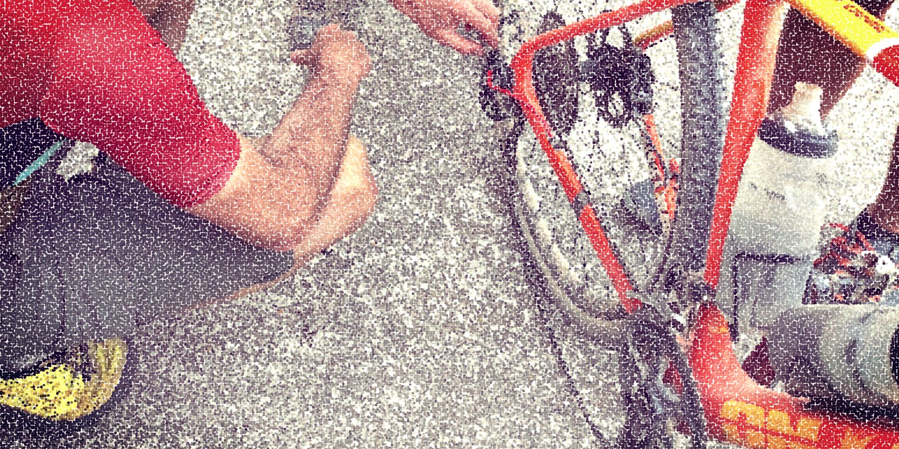

# I hate not knowing how to repair my bike

I live in Copenhagen. Bicycles are my primary means of transportation. On occassion, e.g. when leaving the city, I will use public transportation. I don't have a car or even a driver's licence.

But I *suck* at repairing my bike(s). I want **so bad** to be good at it, but the couple of times I've tried to repair something that was broken on my bicycle, I either chickened out or broke it even more which just made the repair more costly.

And usually I will wait a while *before* I eventually give up and hand it over to the professionals, which just costs me extra money spent on public transportation as I go through this process of swallowing my pride.

I can do a few things, though:

- I keep my chain relatively clean and well-oiled.
- I pump it regularly.
- I can replace or repair a punctured tube. My dad taught me this when I was a child.

But if a spoke breaks or the gears need to be replaced or the derailleur is stuck... yeah, I really can't do anything about that. A spoke costs like 20 kr. here (2-3 Euro), but the repair itself costs maybe ~30 times that.

And I have a sense that the bike mechanics like to exploit my ignorance to get me to agree to additional repairs that aren't strictly necessary, so the final bill usually comes out even bigger.

How *do* I get better? I bought a big book about bicycle maintenance many, many years ago. That initially seemed like the way to go as I am quite a bookish person (or was, before having small children and smartphone addiction), but I discovered that this book couldn't provide the kind of practice that I am longing for. It didn't make the repairs less scary and it didn't teach me what to look out for.

I looked up videos on YouTube, but it also didn't really give me what I was looking for. The parts on the bicycle always seem to differ a little from what's on mine and I realised that I have no idea **whether that difference is significant or not**.

I guess I need some kind of bicycle maintenance course. Something that can teach me increasingly complex repairs and give me the confidence to attempt these when my bike eventually breaks down for real again.

Where do I start?

